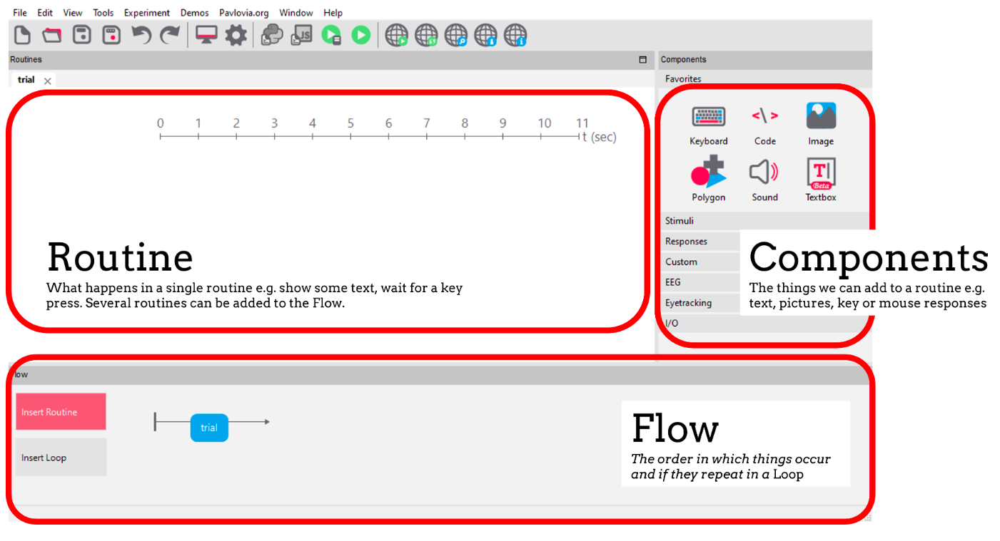
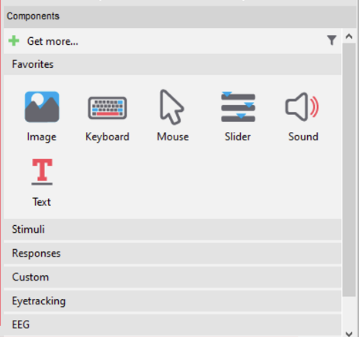

# O Builder

O Psychopy tem a interface `Builder` e a interface `Coder`, dependendo de como você decide utilizar a ferramenta, há espaço para fazer isso dentro do próprio software!!
> Para os coders, podemos utilizar o psychopy sozinho importando dentro de sua IDE de escolha, sem problemas.
Mas, o Psychopy tem algo de diferente, ele permite que você construa o experimento no `Builder` utilizando trechos de código, ou seja mesclando os dois mundos. Mas, isso é apenas um pequeno spoiler. Vamos do começo.

 

- Routine: representa uma 'trial' do seu experimento, organizando o timing de cada componente e como cada elemento se comporta dentro desta. É nesta aba onde adicionamos os componentes, montando e organizando de acordo com as necessidade do nosso projeto. Por exemplo, podemos ter um experimento com duas routines: _desafio_ e _feedback_. Onde logo após o desafio, a pessoa recebe um feedback se acertou ou não.

- Components: Esta é a aba onde ficam todos os componentes que podemos adicionar à nossa rotina. Podem ser: imagem, texto, webcam, áudio, vídeo, resposta de teclado, eyetracker, joystick, e muito mais. Dependendo dos plug-ins ainda é possível conseguir ir além do que os componentes que já vem na plataforma.

- Flow: é a ordem de acontecimento dos eventos no nosso experimento. Cada experimento tem exatamento um Flow. Por exemplo: _boasvindas_, _trial_, _feedback_ e _agradecimento_.

:bulb: Adicionamos rotinas dentro do nosso Flow, e podemos inclusive utilizar 'loops' onde nossas rotinas são repetidas.   Adicionamos componentes às nossas rotinas, e podemos mudar suas configurações, como veremos a seguir.

### O painel de componentes

O painel de componentes é onde ficam os elementos que podemos adicionar às rotinas. Ele é dividido nas seguintes seções: 

- Favoritos: os componentes mais usados pelo usuário
- Stimuli: Componentes usados para mostrar um estímulo. Ex: imagem, forma...
- Responses: Estímulo usado para captar as respostas. Ex: teclado, mouse, entre outros
- Custom: Componentes que te permitem customizar o uso do builder. Por exemplo, o componente de código. É um componente que te permite adicionar trechos de código em Python ou em Javascript ao seu experimento. Abordaremos isso em uma seção mais a frente.
- Eyetracking: o Psychopy não possui mais suporte para Eyetracking de forma embutida no programa. Mas, podemos instalar por meio dos plug-ins.  
- EEG: Podemos utilizar o Psychopy com vários dispositivos EEG por meio de portas serial de entrada e de saída.
- I/O: são as portas seriais de entrada e saída que nos permitem conectar com dispositvos de hardware. Por exemplo: Arduino, dispositivos EEG

### Vamos aprender mais utilizando a plataforma?

Iremos aprender sobre os componentes aplicando o exemplo do **Posner Cueing Task**, um teste neuropsicológico usado para avaliar a mudança de atenção. É usado para avaliar distúrbios, lesão cerebral focal e os efeitos de ambos na atenção espacial.

Criei um jupyter notebook `.ipynb` para te guiar pela construção do experimento. Mas caso esteja com dificuldade, também deixei o arquivo `.psyexp`, a extensão dos arquivos com experimentos feito no Psychopy, com tudo feito.

Bora?