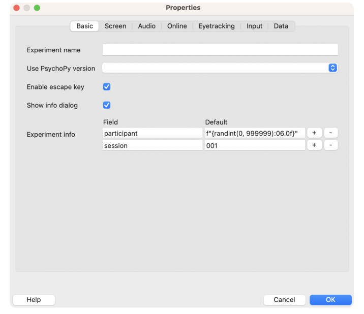

## Explorando o Builder com o `Posner Cueing Task`

Que bom tê-lo aqui! Imagino que já leu o `obuilder.md`, não? Então leia a introdução e depois volte à esta seção.

Bom, antes de tudo, veja o que precisamos para construir esse experimento:
- Alvo
- Uma seta
- Resposta de teclado (esquerda ou direita)

### Adicionando uma Rotina.
Clique no botão `Insert Routine` e insira a rotina no Flow.
<br>
<div align="center">

</div>
<br>

Agora o programa perguntará se você quer adicionar uma rotina já existente ou criar uma nova rotina. Vamos criar uma nova (`new`). Note que, uma rotina já vem por default, a rotina `trial`. 

<br>
<div align="center">

</div>
<br>
Depois, vai aparecer uma janela para que você possa escolher o nome da sua nova rotina como também definir se quer que ela venha em um template já pronto.
<br>
<br>
<div align="center">

</div>
<br>
Note que existem alguns templates que podem te ajudar a ter ideias ou até mesmo a adiantar partes do seu desenvolvimento. Fique à vontade para testá-los quando já estiver entendendo mais do funcionamento do software.
<br>
<br>
<div align="center">

</div>
<br>

Após isso, você deverá definir uma posição na qual sua rotina será colocada dentro do `Flow` do experimento. Assim que você clicar em `Okay` o seu `Flow` entrará em modo espera, com essa aparência:
<br>
<div align="center">

</div>
<br>
Assim você pode posicionar a sua rotina onde quiser, baseando-se na bolinha de referência que aparece na linha do tempo.  Ou, caso queira, pode cancelar a inseção clicando no botão superior esquerdo.

Adicione o componente `Polygon` à sua rotina, basta clicar e configurar. Esta tela irá aparecer:
<br>
<div align="center">

</div>
<br>

Agora adicione um nome, selecione o shape como "triangle" e determine o início como `0.0` e a duração como `1.0`. 

Após isso, vá até a aba `layout` e coloque o `Orientation` para `90`. Ainda mais, se quiser, vá até a aba `Appearence` e escolha uma cor para a sua seta :)

O tempo de início se refere a quando, dentro do tempo cronológico da sua rotina, o elemento irá aparecer.

Agora, clique em `Okay`. Você verá o seu componente dentro da sua rotina. <br>
Adicione outro componente do `Polygon` para ser o seu target, e determine os campos dessa forma:

<br>
<div align="center">

</div>
<br>

Note que, neste caso o campo `durantion(s)` foi deixado em branco, isso significa que o elemento ficará aparecendo na tela até que uma reposta do usuário seja dada. Por exemplo, com o componente `Keyboard Response` podemos receber essa resposta e encerrar o comportamento do polígono `target`.

Detalhe, ainda não terminamos! Vá até a aba `Layout` ainda dentro das propriedade do `target` e coloque a `position` como `(0.5,0)`. 

```quote
A coordenada (x,y) para o centro da sua tela é (0,0).
```

### Posição e Tamanho do componente
Se você deu uma olhada na aba `layout` percebeu que é possível personalizarmos bastante nosso componente. Bom, antes de tudo, vamos entender as unidades que são usadas pelo Psychopy (na aba `Spatial Units`).

### Resumo sobre cada Spatial Unit
- Height unit: com essa unidade, todos os componentes se tornam relativos à altura da janela (não da tela). É escalável de acordo com o tamanho do stimulus. Não precisa de informações do monitor.
- Normalised unit: a janela varia no x e no y do -1 ao 1. Isto é, o canto superior direito é (1,1) e o inferior esquerdo é o (-1,-1).Não precisa de informações do monitor.
- Centimeters on screen: possibilita a inserção da posição e do tamanho exato do stimulu em centímetros na tela. É necessário ter informação sobre a largura da tela em centímetros e o tamanho em pixels.
- Degrees of visual angle: Este depende da distância que o participante se senta da tela. É necessário ter informação sobre a largura da tela em centímetros, do tamanho em pixels e da distância de visualização em centímetros.
    - Esta unidade tem três variantes: _deg_, _degFlatPos_ e _degFlag_. Para saber mais acesse no site oficial a documentação.
- Pixels on screen: permite a especificação do tamanho e da localização do stimulus em pixels. Há uma grande desvantagem dado que seria específico para o seu monitor, todos os monitores diferem em tamanho do pixel. É necessário ter informação sobre o tamanho da tela (não da janela) em pixels, mas isso pode ser deduzido pelo sistema operacional se já foi bem definido.
- from exp settings: herda a unidade escolhida na configuração global do experimento (vamos falar desse tópico no próximo tópico :) )

### Configuração do seu experimento

Na tela principal, clique no ícone de engrenagem e você verá a seguinte tela:

<br>
<div align="center">

</div>
<br>

Todos os campos dentro de `Experiment Info` será apresentado como campos de preenchimento no início do seu experimento. Esses dados servirão como ID's no preenchimento da planilha que o programa entrega no final (veremos mais a frente).

É neste ponto onde você pode alterar o padrão do nome de `participant`, `session` ou outros campos. Exemplo, posso criar mais um campo no `Experiment info` chamado `Group`, e então toda vez que eu rodar o experimento vou poder escrever o nome do grupo o qual o participante é membro. Como também posso remover campos já existentes.

Evite deletar o campo `participant`, pode causar um bug no sistema.

Por meio da aba `Screen` você pode alterar as unidades globais que está usando no experimento, se você quer que ele rode em full-screen e qual monitor você deseja usar (caso esteja usando mais de um).

### Captando uma reposta do teclado e finalizando nosso experimento

Adicione um componente `Keyboard Response` à sua rotina.
<br>
<div align="center">

</div>
<br>

Note mais uma vez, que o `duration(s)` está vazio, indicando que o componente está em funcionamento para sempre ou até outro evento acontecer. 
- `Force end of Routine` indica que quando clicarmos em qualquer uma das `Allowed keys` a rotina atual vai fechar com todos os seus componentes, mesmo os que estão setados para durar para sempre. 
- `Allowed keys` é uma lista dos botões do teclado que serão lidos pelo programa durante a rotina. Isto é, o programa estará observando se houve cliques, por quanto tempo, se foi pressionado e quando, etc. Note que a inserção desta lista deve ser da forma que está na imagem, cada nome entre aspas simples e com vírgulas separando eles.