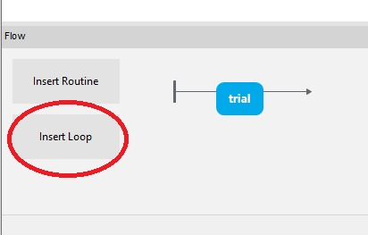
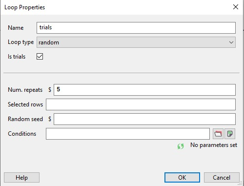
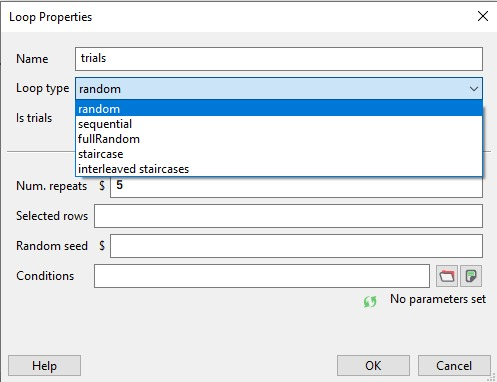
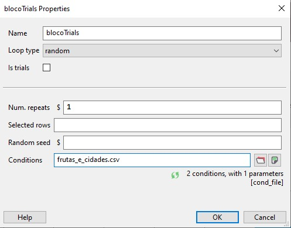
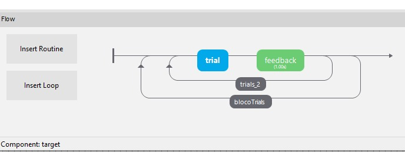
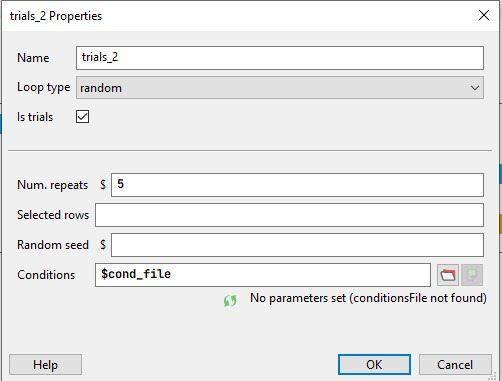

## Loops no experimento
Bom, como você pode ver, podemos construir um experimento utilizando o `Builder View` dentro do software Psychopy. Mas, como podemos deixar essa experimento completo? Até agora, o participante vai visualizar o componente da `seta` na tela por `1.0 segundo` e logo depois verá o `target`, então irá indicar por meio do teclado onde está o target (na esquerda ou na direita).

Mas, para que possamos completar, é necessário realizar isso várias vezes não é? Então, vamos introduzir aqui o conceito de `Loop`.

:lollipop: `Loop` é literalmente um laço, um laço de repetição. Isto é, representa uma estrutura que vai se repetir um trecho do código por um número determinado de vezes. Para já irmos entendendo um pouco de python, na linguagem, o loop tem essa cara:

```python
for i in range(0,11):
    print(i)
```

O código acima representa um loop que vai de 0 até 10 (o segundo parâmetro do `range` é exclusivo) e imprime cada número na tela, assim a saída é a seguinte:

```python
1
2
3
4
5
6
7
8
9
10
```

Bom, então como isso se aplica no nosso experimento? Vamos conhecer a função `LOOP`.

- Os componentes do tipo `loop` controlam repetições de `Routines`. Eles possuem um nome, são únicos e podem ter seus parâmetros alterados de acordo com a necessidade e requisitos do experimento.

### Passo a passo | Trabalhando com Loops 

<br>

1. Insira um novo `loop` clicando no `Insert Loop` localizado no canto inferior esquerdo da tela, dentro do componente `Flow`.
<br>
<br>
<div align="center">

</div>
<br>

2. A seguinte tela vai abrir, mostrando as propriedades do componente `loop`.
<br>
<br>
<div align="center">

</div>
<br>

A checkbox _isTrials_ indica que após cada repetição do loop uma nova linha será adicionada ao arquivo que é retornado ao final do experimento. 
Isto é, cada a checkbox esteja marcada, a planilha ao final do experimento apresentará o resultado de cada uma das trials, caso o usuário acertou, em quanto tempo, qual era a reposta correta. Mas esses parâmetros que estou comentando aqui podem variar também. Depende de como você, pesquisador, definir em cada componente o que ele vai guardar. Normalmente este parâmetro é marcado quando o `loop` demarcam a repetição de `trials`, isso porque alguns loops podem demarcar a repetição de blocos de trials, mas isso veremos um pouco mais a frente... :)

Antes, de falarmos sobre isso, irei mostrar um exemplo de retorno da tabela ao final do experimento com o `isTrials` marcado.

### Afinal, o que temos ao final do experimento rodar? A pasta `Data`
Bom, já comentei bastante por aqui sobre a existência de um arquivo que o programa gera ao final do seu experimento. Entretanto, ainda há muito mais a se falar sobre essa ele. 

Assim que você roda o experimento pela primeira vez, o psychopy vai criar uma pasta chamada `Data` no seu computador, localizada no mesmo local onde o seu experimento `.psyexp` está. Nesta pasta, por padrão, serão gerados três tipos de arquivos diferentes ao final de um experimento. Esse são um excel data file, log file e um data file (`.psydat`).
    
- log file: é um arquivo de `logging`, um arquivo que guarda os acontecimentos dentro do programa em ordem cronológica. Ex: chamadas de função, etc.
- excel data file:  essa é a planilha que retorna todos os resultados do participante naquele experimento que foram captados pelo Psychopy.
- Psychopy data file (.psydat): arquivos que guardam dados que normalmente você esqueceu de salvar pelo Psychopy. São usados por usuários com um pouco mais de experiência em python e talvez matplolib (uma biblioteca do python).

Aqui, o arquivo que nos interessa (pelo menos geralmente, mas depende do seu experimento), é o arquivo de excel.

Certo, mas que atributos são esses? Como posso interpretar? Pegar um dado específico?

Como você bem sabe, existem diferentes tipos de experimentos, e claramente cada um deles tem objetivos diferentes. Então talvez alguns dados façam mais sentido para uns e menos sentido para outros. 

Em primeiro lugar, se você consultar a aba `Experiment info`, aquela que falamos há alguns tópicos atrás com uma engrenagem como logo, ela tem uma aba chamada `Data`. Nessa aba você pode realizar as configurações gerais da pasta. Como por exemplo, definir se você quer que o programa gere os três tipos diferentes de arquivo mesmo, ou se quer apenas 1 deles, o `.csv` por exemplo. Também mudar o padrão de nome dos arquivos, a forma como ele é gerado...Por padrão, ele une o nome do participante com a hora que o experimento ocorreu.

Além disso, cada componente do Psychopy tem uma aba chamada `Data`, nesta aba você consegue definir se quer guardar dados daquele componente em sua resposta ou não. Por exemplo, o `Camera Component` permite que você defina se quer salvar o vídeo que foi gravado durante o experimento. 

O psychopy consegue ir ainda mais além do que salvar, em alguns componentes você ainda consegue definir a resposta correta em um campo chamado `correct answer` e a resgatar de uma planilha adicionada ao projeto. Depois disso, guardar caso o participante acertou ou não.

### Elementos do `Loop`
Okay, esse foi um loooongo parênteses, não é mesmo? Que tal voltarmos a falar sobre o componente `loop`? Haviam vários outros campos que não comentamos ainda. Vamos nos debruçar sobre cada um?

<br>
<br>
<div align="center">

</div>
<br>

- `Num. repeats` representa a quantidade de vezes que você deseja repetir cada uma das condições que estão na sua planilha. Isto é, para cada linha o valor/imagem/texto aparecerá X vezes no experimento.
    Por exemplo,
    | nomes |
    | -- |
    | Maria |
    | José |
    | Davi |

    Note que, neste exemplo, temos três valores da coluna `nomes`, os valores são: "Maria", "José" e "Davi". Se o campo `Num. repeats` estiver com o valor `5`, então teremos uma lista do tipo:
    ```
    Maria
    Maria
    Maria
    Maria
    Maria
    José
    José
    José
    José
    José
    Davi
    Davi
    Davi
    Davi
    Davi
    ``` 
    Onde cada rodada do `loop` atribuirá um desses valores à variável `nomes` - que é o nome da coluna da planilha. (Falaremos sobre variáveis dentro do Psychopy no próximo tópico)
    
    O que nos leva ao próximo campo.
- `Loop type` representa a forma de aleatoriedade ou não que você deseja no seu laço. Existem algumas opções, vou abordar de forma sucinta aqui sobre cada uma delas, porém caso você deseje saber mais, tem uma página inteira sobre isso na documentação do Psychopy. 
<br>
<br>
<div align="center">

</div>
<br>

- Random:
- Sequential:
- 


### USO DE VARIÁVEIS EM MEIO AO CÓDIGO

### Usando Loops para blocos
E se o nosso experimento tiver diferentes bases, com diferentes propósitos e quisermos aplicar os dois em um mesmo loop? Aleatorizando a aparição de cada um? Bom, isso é possível!

Exemplo: imagine que você tem duas planilhas, a primeira se chama `frutas.csv`, e ela tem esse formato: uma coluna nomeada **imagens** e os seus valores.

| imagens | 
| ---- |
| banana.png |
| maca.png |
| pera.png |

Já a segunda se chama `cidades.csv` e tem o seguinte formato: uma coluna nomeada **imagens** e os seus valores.

| imagens | 
| ---- |
| natal.png |
| toronto.png|
| belohorizonte.png |

Imagine agora que você deseja fazer um experimento onde o participante vai receber como estímulo imagens de frutas e de cidades, aleatorizadas, uma de cada vez, por um pequeno período de tempo, e ao final precisa responder o que lembra ter visto.

Logo, o desafio é juntar as duas bases e misturar seus stimulus. Como faremos isso? O componente `loop` pode nos ajudar mais uma vez.


Primeiramente, iremos criar uma nova planilha, eu vou chamá-la de `frutas_e_cidades.csv` mas você pode dar o nome que achar melhor.

Nessa planilha, criarei uma coluna chamada `planilhas` e adicionarei os nomes das nossas basess: `cidades.csv` e `frutas.csv`. Ficará da seguinte forma:

| planilhas | 
| ---- |
| frutas.csv |
| cidades.csv|

Logo, após salvar o arquivo, podemos voltar ao Psychopy e modificar o nosso loop `trials`. Podemos renomeá-lo para `blocoTrials`, mudar o nome do `Conditions` para o nosso arquivo `frutas_e_cidades.csv` e desmarcar o `IsTrials`. 
<br>
<br>
<div align="center">

</div>
<br>


Lembra que eu comentei sobre o `isTrials` uns tópicos atrás? Bom, neste caso, estamos lidando com um loop que trabalha com blocos de trials, logo caso deixemos esse checkbox marcado, o data file final do nossos experimento terá uma linha a mais além dos resultados das `trials` após cada final de bloco. Para explicar melhor, o data file final teria como primeiras colunas algo desse tipo: 

| planilhas | images | blocoTrials.thisRepN |
| ---- | --- | ---- |
| frutas.csv | banana.png | 0 |
| frutas.csv | pera.png | 0 |
| frutas.csv | maca.png | 0 |
| frutas.csv | -  | 0 |
| cidades.csv| natal.png | 0 |
| cidades.csv | toronto.png | 0 |
| cidades.csv | belohorizonte.png | 0 |
| cidades.csv | - | 0 |

Note a presença de uma linha a mais com o valor de `imagens` vazio após a finalização de cada bloco de trials. Isso representa a passagem pelo loop, que ele também conta. Mas são linhas que não importam neste experimento, então, deixamos o `isTrials` desmarcado.

Após isso, adicionaremos um segundo loop! Isso mesmo. Este iremos inserir dentro do loop anterior, posicione-o após o início do loop `blocoTrials` e antes do final do mesmo. Ele ficará assim:
<br>
<br>
<div align="center">

</div>
<br>

Nas propriedades do loop, iremos utilizar uma variável para indicar a coluna onde estão os nomes das planilhas! Ou seja, no campo `Conditions` coloque o `$planilhas`, que será reonhecido pelo programa por ser uma coluna na planilha `frutas_e_cidades.csv`. 

<br>
<br>
<div align="center">

</div>
<br>

Dessa vez, marque a opção `isTrials` dado que será um loop que demarca a repetição de trials em si, e não de seus blocos.

Lembre que, como falamos anteriormente, você pode mudar as configurações do loop como o seu tipo, quando vezes será repetido, quais linhas da planilha serão mostradas, etc.

Após essa configuração, adicione um componente de imagem na sua rotina `trial` e configure adicionando o valor `$imagens` ao campo `Image`.

Logo, inicie o experimento e você verá as imagens de frutas e cidades aparecendo de forma aleatória.

Para finalizar a implementação da ideia do experimento que dei nesta seção, basta adicionar uma nova rotina, pode ser chamada de `resposta`, e adicionar um componente `TextBox` que recebe uma resposta do usuário. Então determine a duração para infinito, e adicione um `Keyboard Response` que force a finalização do experimento quando o participante clicar na barra de espaço, por exemplo (você também pode adicionar uma rotina de instrução avisando sobre esse comportamento por um tempo antes de liberar a rotina `resposta`)

### Indo além: Como posso misturar dados de texto e imagens dentro dos meus loops em blocos de trials?

Bom, e se as planilhas fossem desta forma?

- **frutas.cv**

    | imagens | 
    | ---- |
    | banana.png |
    | maca.png |
    | pera.png |

- **cidades.csv**

    | cidades | 
    | ---- |
    | Natal |
    | Toronto|
    | Belo Horizonte |


Bom, neste caso temos um desafio, dado que caso utilizemos a variável de uma, por exemplo `$imagens` dentro de qualquer componente da rotina, quando a planilha `cidades.csv` estiver no loop, o programa retornará um erro. Não existe essa variável (coluna) nesta planilha. Pelo menos, caso sigamos o padrão que construí para o último exemplo:

<br>
<br>
<div align="center">

</div>
<br>

Se usarmos mais de um loop dentro de `blocoTrials`, vou chamá-lo de `trials_3`, setando o `Selected Rows` do `trials_2` para 0 e o `Selected Rows` do `trials_3` para 1 (indicando cada linha do frutas_e_cidades.csv), teríamos então uma outra resolução. E funcionaria. Porém, os dados ficariam separados em loops diferentes.


Então, para usar o mesmo loop, como fizemos no exemplo anterior, seria necessário usarmos codificação em python com o `Code component`. Eu deixei um experimento pronto aqui no repositório para caso alguém tenha interesse em ver como foi feito. Basicamente usando um `Text Component`, `Image Component` e um `Code Component`. O código é bem fácil de entender e vou explicar aqui embaixo para os curiosos.

Note que cada componente é uma variável no programa, assim como as colunas das planilhas, como vimos anteriormente. Aqui, o que fiz foi o seguinte: 

-  Coloquei o`Image Component` com o nome de `image_comp`, escolhi uma imagem aleatória dentro da minha pasta para ser a imagem do componente no `Image` e setei o parâmetro como `set every frame`. Além disso, na aba de layout, determinei a opacidade da imagem como 0, signfica que ela está invisível.
- No `Text Component` eu coloquei o texto como a variável `$fb`.
- No `Code component`, eu coloquei no `Begin Routine` o código:
    ```python
        fb = ''
    ```
    Com o intuito de inicializar a variável.
- Ainda no `Code component`, na aba `every frame`, utilizei o código abaixo:
    ```python
        if planilhas == 'frutas.csv':
            image_comp.setOpacity(1)
            image_comp.setImage(imagens)
        else:
            fb = cidades
            image_comp.setOpacity(0.0)
    ```
    Se a variável planilhas estiver com o valor == `frutas.csv`, significa que o loop `trials_2` está rodando dentro dessa planilha. Logo, os itens são imagens! Então, eu devolvo a opacidade total da imagem (para que ela apareça na tela) e então determino qual imagem quero que apareça. Essa variável, `imagens` a coluna da planilha `frutas.csv`, então a cada frame uma linha será selecionada como valor de `imagens`. Assim, o código irá atribuir a imagem atual ao componente `image_comp`.
    Caso contráro, a variável `planilhas` está com o valor `cidades.csv`, dado que só temos essas duas opções em nossa planilha (nada impede que adicionemos mais). Logo, estamos trabalhando com textos, pois sabemos que essa planilha possui nomes de cidades. Assim, utilizaremos a variável já criada `fb` e atribuiremos à ela o valor de `cidades`, campo do `cidades.csv`. Após isso, o componente `image_comp` tem a sua opacidade setada para 0 novamente para evitar que a imagem cubra a visualização do texto.

E assim temos o nosso experimento com diferentes tipos de dados de difentes bases de entrada! :)

 O código e seus utilitários (imagens e planilhas) estão nesta pasta: [nestedLoopsVariousTypesOfFiles](experimentos/nestedLoopsVariousTypesOfFiles/)


