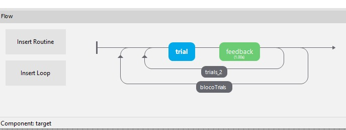

##  Adicionando Feedbacks e trabalhando com o `Code Component`

Bom, até agora aprendemos a como fazer tipos de experimentos com rotinas que se repetem, como utilizar variáveis, como adicionar planilhas com dados no programa e como randomizar seus dados de acordo com o objetivo do seu experimento.

Agora, e se quisermos dar o feedback imediato ao participante durante a rotina? Por exemplo, e se quisermos mostrar a ele se ele clicou acertou ou erro durante o `Posner Cueing Task`? Isso é possível! Mas para isso, precisamos introduzir um componente que mistura os 'dois mundos' que compõem o Psychopy, o `Code Component`.

Já conversamos em tópicos anteriores, que o Psychopy é um software que permite que o participante construa o seu experimento à partir do `Builder View` como também à partir do `Coder View`. O Psychopy também é um package do python, uma coleção de vários módulos (funcionalidades), por isso podemos utilizá-lo programando.


### O `Code Component`

É um componente que pode ser usado para inserir pedaços de código em python à sua rotina. É usado para criar variáveis que você usará em outro componente, para manipular imagens, textos, para interagir com um hardware (por meio de portas serial).

Tome cuidado, a ordem em que os componentes da rotina são executados é de cima para baixo, logo caso você esteja usando uma variável dentro de um componente `Image` que foi inicializada em um `Code Component`, tenha certeza de que o `Code Component` está localizado acima do `Image`. Caso não esteja, o programa retornará um erro, falando que a variável ainda não existe. Lembre que no código, por baixo dos panos, o código está sendo escrito - automaticamente - na ordem em que está o seu experimento.

#### Exempo de uso do `Code Component`
- Determinar uma localização aleatória para o estímulo alvo (target).
- Enviar uma mensagem de feedback ao final do experimento.
- Terminar um loop mais cedo, ou quando um participante acertar um determinado número de vezes.

Veremos mais para frente exemplo com código.

#### Parâmetros

O Psychopy possui o seu irmão, o `PsychoJS`, que foi criado para que fosse possível realizar os experimento na plataforma online (falaremos disso em outra classe). Dado isso, ao abrir o `Code Component` você verá uma aba com o nome `Code type`. Nessa aba, você verá as seguinte opções:
- Py : python code
- JS: Javascript code
- Auto-> JS: onde você programa em python e o próprio Psychopy traduz para javascript automaticamente.
- Both: você programa em python e em javascript, um independe do outro. Esta funcionalidade serve para quando você deseja que o seu programa se comporte de forma diferente ao rodar online (no Pavlovia). Já o código em python apenas será executado quando você estiver em sua máquina local.


#### Noções de lógica de programação
> Vou falar um pouco de como funciona a lógica de programação, só para que você compreenda mais quando eu for introduzir sobre o `Code Component`. Mas, caso você deseje ir mais fundo, eu indico procurar os cursos de programação básica para psychopy indicado no site deles. Vou deixar aqui o link: [psychopy.org/teaching/](https://psychopy.org/teaching/index.html)

Imagine que você quer fazer um bolo, normalmente existe uma receita que é seguida que possui o passo a passo. Assim também é com o código.

Se eu quero realizar a soma de 3 números, como faço?

Bom, primeiramente, eu preciso ter os 3 números. Então irei criar uma `variável` e em seguida irei `atribuir` um valor `a ela.

```python
numero_1 = 1
numero_2 = 2
numero_3 = 3

```

Pronto, agora podemos dizer que _temos_ 3 variáveis em nosso programa.

E agora? Qual é o próximo **passo**? Realizar a soma!! Então, seria:

```python
numero_1 + numero_2 + numero_3
```
Exatamente! Isso funciona em python. Mas, e se quisermos `guardar em uma variável para utilizar depois?
```python
soma = numero_1 + numero_2 + numero_3
```
Perfeito! Agora já podemos utilizar essa nova variável em nosso programa.

E se eu quiser mostrar essa variável na tela? Posso usar a função `print()`! Dessa forma:
```python
print(soma)
```

Show!

Bom, agora imagina outra situação. Você é o programador(a) de um sistema de escola e precisa mostrar para o aluno João que ele foi aprovado caso a sua nota tenha sido maior do que 7.0. Você tem uma variável com a nota que o João tirou na última prova, a nota é 7.8, como mostrar que ele foi aprovado?
```python
nota_do_joao = 7.8
```
Esse problema utilizado do conceito de `condicional`. Isto é, é uma condição para que algo aconteça. 

Se _João tirou uma nota maior do que 7.0_ então _João foi aprovado_, Senão _joão foi reprovado_.

Na sintaxe do código python, essa afirmação ficaria assim:
```python
if nota_do_joao >= 7.0:
    print("João foi aprovado")
else:
    print("João foi reprovado")
```

Dessa forma, aplicamos a nota de João na condição para que o código de cima `print("João foi aprovado")` ou o debaixo `print("João foi reprovado")` seja executado. Note que, dependendo do valor da variável `nota_do_joao`, o resultado será diferente. Esse é o trabalho com condicionais.

Bom, essa é uma explicação bem básica sobre conceitos de lógica de programação, só para que você não se perca muito no próximo tópico. Mas caso não tenha sido suficiente ou você queira se aprofundar _mesmo_, eu indico muito ir atrás dos cursos que mencionei acima.


#### Onde seu código será adicionado

No componente você verá 6 abas onde pode adicionar código.

- `Before Experiment`: onde se insere funcionalidades que só precisam ser feitas uma vez, como por exemplo, importar um módulo. Não é necessário que a janela do experimento exista ainda.
- `Begin Experiment`: da mesma forma, só é executada uma vez. Nesse caso, este é o campo onde há inicialização de variáveis que serão utilizadas, por exemplo. Neste ponto a janela do experimento já existe.
- `Begin Routine`: Define o ponto de início daquela rotina específica. Em uma rotina que está dentro de um loop, por exemplo, é este o ponto onde o código será executado `a cada início de iteração. É onde você pode decidir qual lado o stimulus irá aparecer.
- `Each Frame`: tudo o que precisa ser atualizado constantemente, a cada quadro. Por exemplo stimulus que trabalham com animação.
- `Each Routine`: é executado ao final de cada rotina, onde você pode verificar se o participante errou ou acertou.
- `End Experiment`: use este campo para salvar dados, apresentar um grafo ou até mesmo resetar o hardware aoa seu estado original.


#### Adicionando código dentro dos componentes
Já conversamos sobre esse ponto anteriormente, mas agora quero trazer exemplos para abrir ainda mais a sua perspectiva sobre o uso de variáveis no Psychopy.

Essa planilha abaixo foi criada para o `Posner Cueing Task`. Você a verá no arquivo do experimento. 

| arrow_orientation | target_x | correct_keypress | condition |
| --- |  --- | --- | --- |
| 90 | 0.5 | right |valid |
| 270 | -0.5 | left | valid |
| 90 | -0.5 | left  | invalid |
| 270 | 0.5 |right | invalid|

Note que a posição do target já está mapeada, basta adicioná-la no programa. Como faremos isso? 

No componente da imagem `target`, vamos adicionar no campo `Position` na aba `layout` o seguinte:
```
(target_x,0)
```
Defina esse campo para `set every repeat`.

E no componente da imagem da seta, no campo `Orientation` adicionar:
```
arrow_orientation
```
Defina esse campo para `set every repeat`.

#### Enfim, como adicionamos o feedback ao nosso experimento?

Primeiramente, criamos um novo componente chamado `feedback` que vai contem dados do tempo de resposta (RT) e uma imagem avisando que o participante errou ou acertou. Vamos adicioná-lo logo após o `trial` do nosso experimento.

<br>
<br>
<div align="center">

</div>
<br>

No componente do `Keyboard Response` do `trial`, o `key_resp`, vá até a aba `Data` e faça:
- check no campo `Store Correct`
- No campo `Correct Answer` referencie o campo da planilha `$correct_keypress`. 

Adicione um `Code component` na sua rotina, na seção `Begin Routine` insira o seguinte código python.

```python
    if key_resp.corr == 1:
        fb = "Correct! Reaction Time: " + str(int(key_resp.rt*1000)) + 'ms'
        fbim = "correct_image.png"
    else:
        fb = "IncorrectReaction Time: " + str(int(key_resp.rt*1000)) + 'ms'
        fbim = "incorrect_image.jpg"
```
> Você pode encontrar as duas imagens nesse repositório [aqui](experimentos/). Você deve colocá-las na mesma pasta onde o seu experimento se encontra ou alterar o `path` dela (localizado na variável `fbim`).

- O `key_resp.corr` é uma variável interna do componente `Keyboard Respose` que indica se o participante acertou ou não a resposta. Baseado no campo `Correct Answer` que atribuímos um valor a ele anteriormente (de acordo com a planilha)
- O `key_resp.rt` é a variável que guarda o `Response Time` do participante, é a duração do tempo desde o início da iteração daquela rotina até a resposta do participante.
    - É multiplicado por `1000` para ficar em milisegundos.

Logo após, adicione um `Text Component` e coloque a variável `$fb` no campo de texto. Faça o mesmo com a imagem, adicione o `Image Component` e coloque o `$fbim` no campo de `Image`. Ademais, não se esqueça de definir os dois para `set every repeat` dado que estamos trabalhando dentro de um loop.

Ah, não se esqueça de definir um tempo para os componentes. No experimento que criei, deixei por `2seg` tanto o `Text Component`  como o `Image Component`.

Assim, podemos rodar nosso experimento e ter o feedback! :)

#### Como guardar a acurácia das respostas do participante por meio das repostas de teclado?

Note que a tabela que mostrei acima possui a coluna `$correct_keypress`, ela é a nossa referência. Já marcamos o campo `Store Correct` e preenchemos o `Correct Answer` no `key_resp` da rotina `trials`. Logo, no arquivo final (na pasta Data), veremos uma coluna (a `key_resp.corr`) indicando se o usuário acertou ou não.

Caso você não queira que a coluna apareça assim:

| key_resp.corr |
| --- |
| 1 |
| 0 |
| 1 |
| 1 | 

> Por padrão, o programa calcula 1 para resposta correta e 0 para incorreta.

Podemos utilizar o `Code Component` para ficar mais bonito.

Dentro do `trials`, adicione um `Code Component` ao final da rotina. 
No campo `Begin Experiment` crie uma nova coluna para a planilha final:
_todo!()_
No campo `End routine` faça:

```python
if key_resp.corr == 1:
    ....
```
_todo!()_