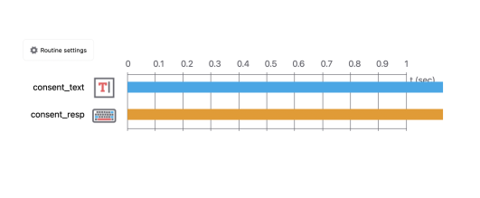
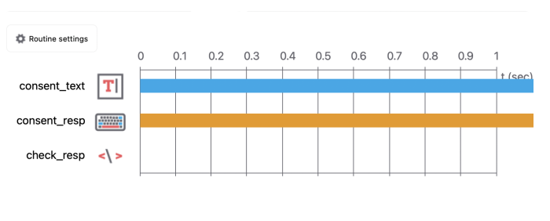
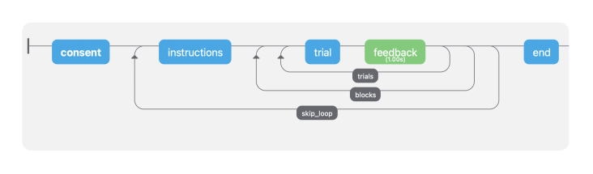

## 🌳 Branched Design

Imagine que você deseja mostrar uma parte do experimento apenas para um determinado grupo, ou até mesmo, apenas se o participante quiser fazer. Vamos introduzir o conceito de Branched Design.

- Adicione uma rotina de consentimento, chamada `Consent`. Ela vai conter um componente de texto, o `consent_text` e um componente de resposta de teclado, o `consent_resp`.
    <br>
    
    <br>
    O texto do `consent_text` poderia ser: _"Você concorda em realizar esta parte do experimento? Pressione S ou N"_.
    <br>
- Adicione um componente de código com a seguinte lógica:
    ```python
        if consent_resp == 'S':
            show_task = 1
        else:
            show_task = 0
    ```

    
    <br>
- Adicione um loop ao redor de tudo o que você deseja pular caso o participante não queira realizar a rotina.
    <br>
    
    <br>
- Então, dentro do loop adicionado, o chamado `skip_loop`, defina o `nReps` como `show_task`. Por que? Note que quando o `show_task` for `0`, o loop será totalmente ignorado e a próxima rotina a ser executado será a `end`. Caso contrário, o loop só será executado uma única vez, sem repetições.


Gostou do `Branched Design`? Acredito que aumentou e muito as possibilidades de criação de rotinas e experimentos! Pratique um pouco e pense sobre como poderia aplicar suas ideias usando esse tipo de design. 🤗