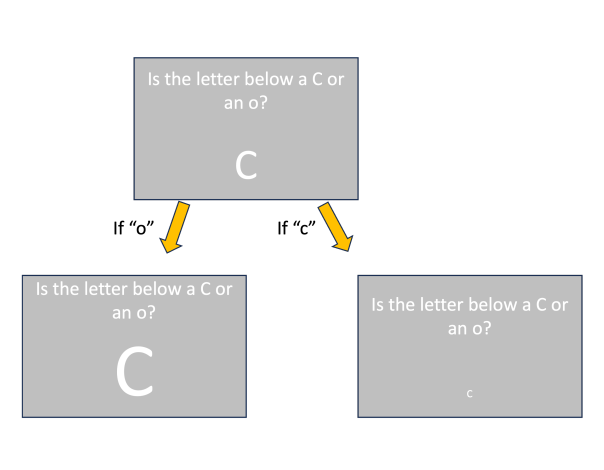
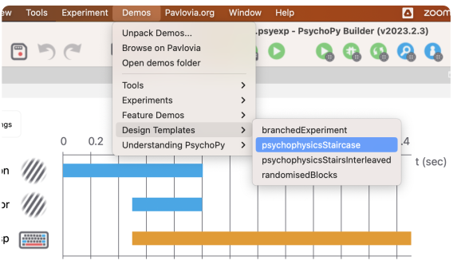
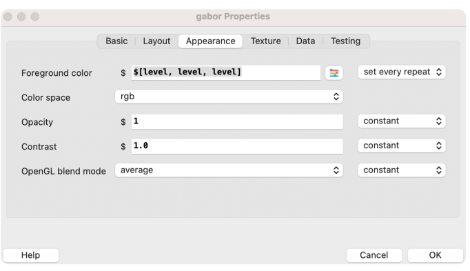
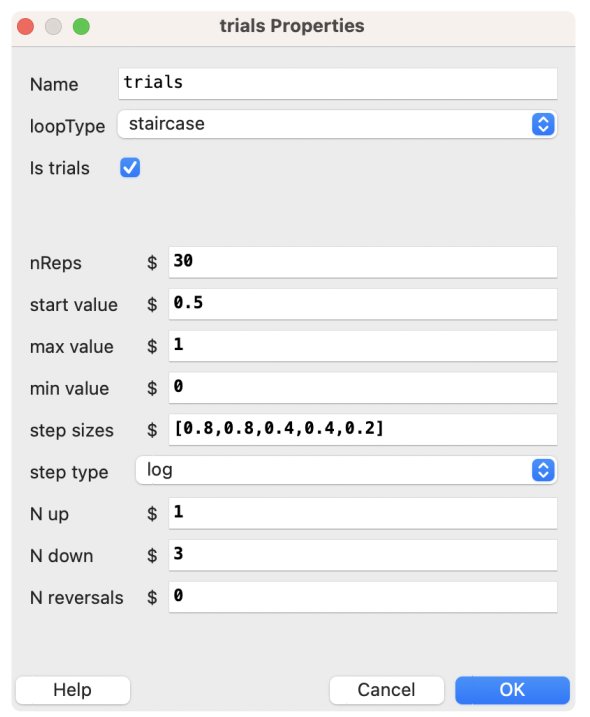

## 🏓Adaptive Design

Este é o design que permite que um `task` se torne gradualmente mais difícil, baseado em respostas anteriores.

No exemplo abaixo, a letra fica menor se o participante está incorreto, e maior caso esteja correto.
 

 

Um exemplo desse tipo de design é o `StairCase` loopType. 

Vamos ver um exemplo aplicado no `psychophysics`?  Abra o `Psychopy` e entre nessa demo:
 

 
 

 

Esse experimento usa o valor de `level` adaptado pela `staircase` para atualizar a cor baseada na resposta do teclado do participante.
 

 

- As configurações do loop indicam os parâmetros do `psychophysics staircase`. O `start value` é o valor inicial da variável `level` e em cada inversão ele será atualizado com base no atual `step size`, neste caso utilizando steps do tipo `log`.

Entretanto nem sempre precisamos dele, caso você não queira utilizá-lo, o `Adaptive Design` pode ser implementado utilizando apenas o `Code Component`.
